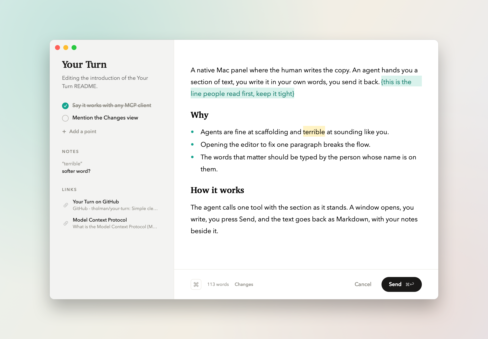
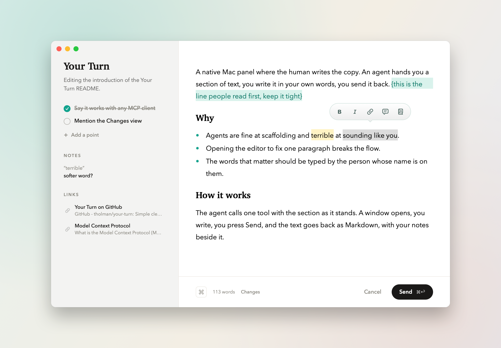
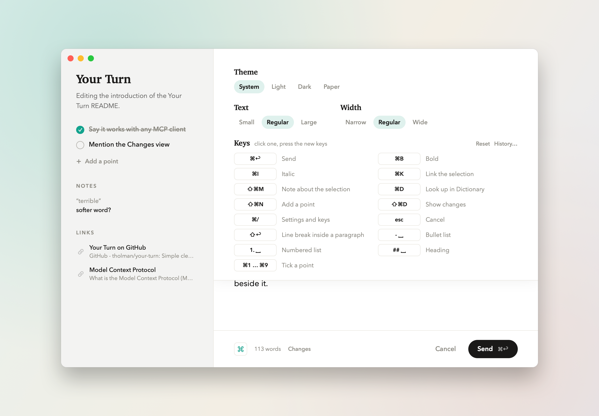
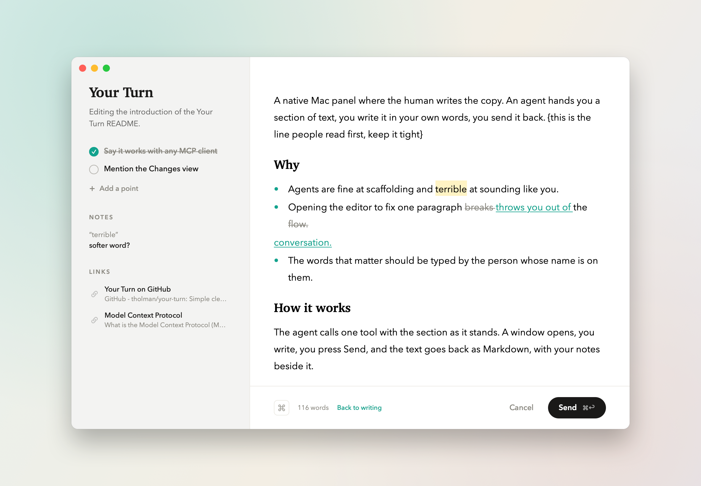

# Your Turn

A native Mac panel where the human writes the copy. An agent hands you a section of text,
you write it in your own words, you send it back.

Built for Claude Code, but it is a plain [MCP](https://modelcontextprotocol.io) server over
stdio, so any MCP client can use it.

The agent calls the `your_turn_write` tool with the name of the thing, a one-line brief, the
section's current Markdown and any points to hit. A window opens in the middle of the screen:
points and links in the sidebar, a rich-text writing area on the right, pre-filled with the
text as it stands. You write, tick points off, press ⌘↩, and the text comes back as Markdown.
The tool call blocks until you send or cancel.

## Install

macOS 13 or later. Needs the Command Line Tools only; no Xcode.

    make app        # builds .build/YourTurn.app
    make test       # runs the self-tests
    make demo       # opens a sample panel and prints the result as JSON

Register it with Claude Code (user scope, so every project sees it), then start a new session:

    claude mcp add --scope user your-turn -- "$PWD/.build/YourTurn.app/Contents/MacOS/your-turn" --mcp

`make install` does the same.

## Writing

- Select text for the hover bar: bold, italic, link, note, look up. The link button turns the
  bar into a paste field; a pasted address commits on its own. The note button attaches a
  comment to that run of text; notes come back beside the copy, never inside it.
- Write `{like this}` for an aside to the agent; it lights up and comes back separately.
- Enter starts a paragraph, Shift+Enter breaks a line. `- ` and `1. ` at the start of a line
  begin lists, `## ` a heading; Return continues a list, Return on an empty item ends it.
- Autocorrect, spelling and grammar use the system dictionary. Look Up opens the Dictionary
  popover, Thesaurus included.
- ⌘1 … ⌘9 tick points, ⌘⇧N adds one, ⌘⇧D shows what changed against the draft.
- ⌘/ opens settings above the writing area: theme (system, light, dark, paper), text size,
  column width, and every key, recordable by clicking it. Settings live in
  `~/Library/Application Support/your-turn/`.
- Every send, and every discarded edit, is appended to `history.jsonl` in that folder;
  `your-turn --history` lists the last ten.

## Tool shape

One call is one piece of copy.

    your_turn_write({
      title:   "Tetrachord",
      context: "Editing the About page for Tetrachord on musical.toys.",
      draft:   "Tetris, but the blocks are the song.\n\n- **Every block is a note.** Drop a piece and it loops.",
      points:  [ { id: "forever", label: "Say the playhead never stops" } ],
      references: [ { label: "About Tetrachord", url: "https://musical.toys/toys/tetrachord/about/" } ]
    })

Returns `text` (Markdown), `points` with `done` per point, `notes` as `{quote, note}` pairs,
`asides` (anything written in `{curly braces}`, an instruction to the agent rather than copy),
and `status` (`sent` or `cancelled`). Points the human added come back with ids like `added-1`.

A good agent-side recipe: pass the section verbatim as `draft`, keep `context` to one line,
use `points` only for genuine gaps, then on return strip the asides and act on them, fix
spelling, link mentions of other pages on the same site, and write the text back into the
same section. Leave the voice alone.

## Without an agent

    .build/your-turn --file request.json           # prints the result JSON on send
    .build/your-turn --demo --snapshot out.png     # also renders the panel to a PNG
    .build/your-turn --demo --screenshots docs     # the README screenshots

## Source layout

    Sources/YourTurn/
      main.swift            entry point and flags
      App/                  app delegate, menus, panel window, panel queue, Dock mark
      MCP/                  stdio JSON-RPC and the tool definition
      Model/                request, result, editor state
      Editor/               theme, lists, Markdown, the text view, the hover bar, SwiftUI wrapper
      UI/                   sidebar, writing area, diff view, footer, settings drawer
      Support/              settings, key bindings, key recorder, diff, history, link titles, snapshots
      Tests/                self-tests, compiled in (`make test`)
    Resources/Info.plist    the app bundle's plist
    docs/                   screenshots

## License

MIT.
